# 📋 Google Forms — Desplegable Dinámico

Script de Google Apps Script que actualiza automáticamente un menú desplegable en Google Forms, eliminando las opciones que ya fueron seleccionadas por usuarios anteriores. Útil para rifas, asignación de números, reservas de lugares, etc.

---

## ¿Cómo funciona?

```
Usuario llena el formulario
  → Google Sheets guarda la respuesta
    → Trigger dispara el script
      → Script detecta qué números ya se usaron
        → Desplegable se actualiza quitando esos números
          → El siguiente usuario ya no los ve
```

---

## Estructura del proyecto

```
/
├── Code.gs       ← Script principal (Google Apps Script)
└── README.md
```

---

## Requisitos

- Cuenta de Google
- Google Forms con exactamente estas dos preguntas (en este orden):
  1. **Nombre completo** — tipo *Respuesta corta*
  2. **Selecciona tu número** — tipo *Menú desplegable*
- Google Sheets vinculado al formulario
- Pestaña llamada `Configuracion` (sin tilde) con los números en la columna A

---

## Configuración paso a paso

### 1. Crear el Google Form

- Ve a [forms.google.com](https://forms.google.com) y crea un formulario nuevo

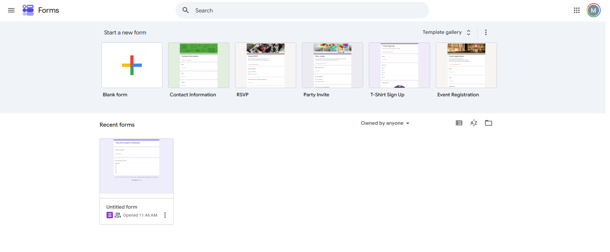

- Agrega las dos preguntas indicadas arriba
- En la pregunta desplegable pon al menos una opción temporal (el script la reemplazará)

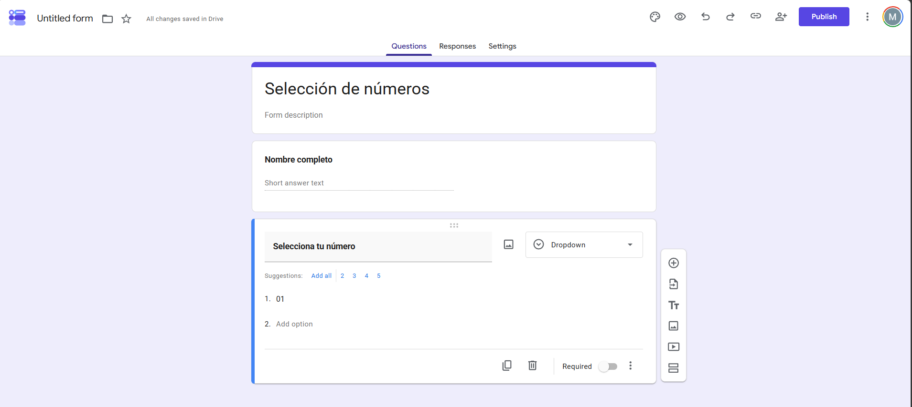

### 2. Vincular a Google Sheets

- En el Form, ve a la pestaña **Responses**
- Clic en **Link to Sheets**

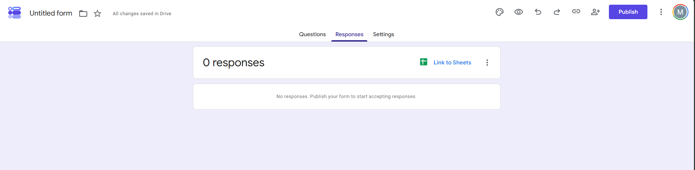

- Selecciona **Create a new spreadsheet**, ponle nombre y clic en **Create**

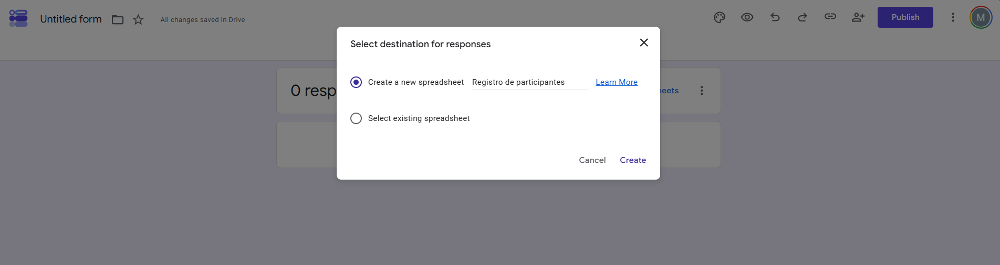

- Se abrirá el Google Sheet con las columnas creadas automáticamente

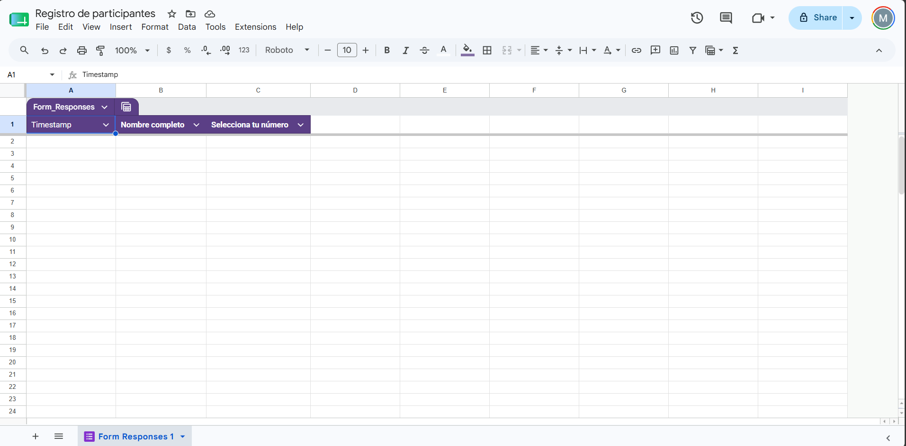

### 3. Crear la hoja Configuracion

Dentro del Google Sheet creado:

- Agrega una pestaña nueva llamada exactamente `Configuracion` (sin tilde)
- Escribe tus números en la columna A, uno por fila:

  | A |
  |---|
  | 1 |
  | 2 |
  | 3 |
  | … |

> **Tip:** Escribe `1` en A1, `2` en A2, selecciona ambas y arrastra el cuadrito azul hacia abajo para llenar rápido.

> **Opcional — números aleatorios:** Si en lugar de una secuencia ordenada quieres un listado aleatorio de números, pega la siguiente fórmula en la celda A1 de la hoja `Configuracion`:
>
> ```
> =ARRAY_CONSTRAIN(SORT(SEQUENCE(901;1;100);RANDARRAY(901);TRUE);300;1)
> ```
>
> Esto genera 300 números únicos tomados al azar del rango 100–1000, sin repetición.

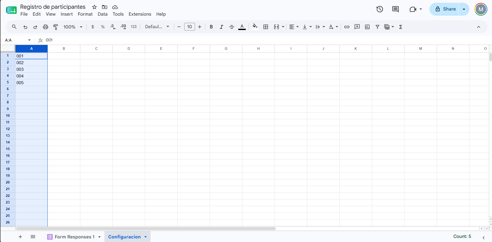

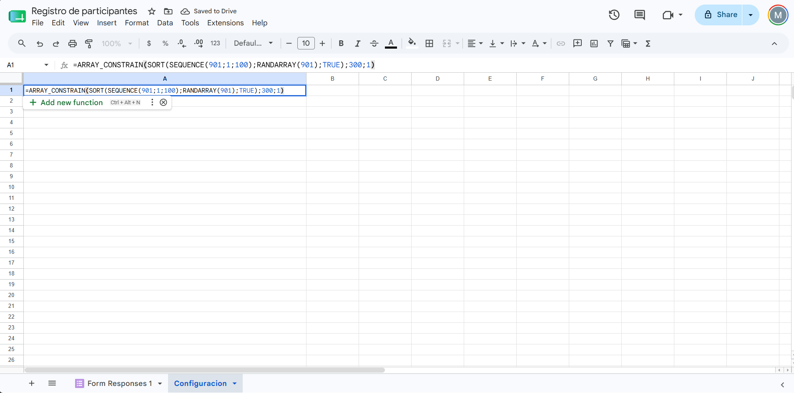

### 4. Agregar el script

- En el Google Sheet, ve a **Extensions → Apps Script**

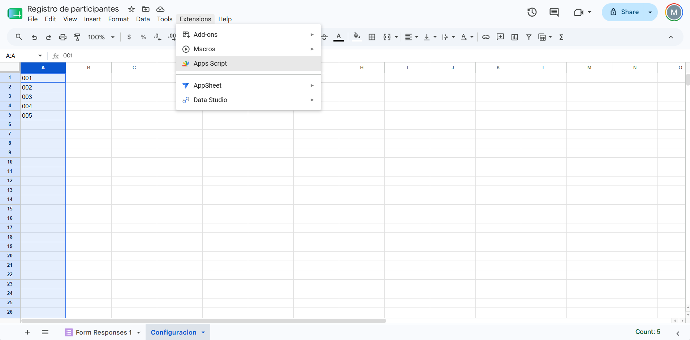

- Borra el código por defecto y pega el contenido de `Code.gs`

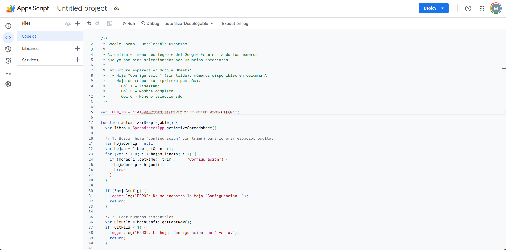

- Reemplaza `ID_GOOGLE_FORMS` con el ID real de tu formulario

El ID se obtiene de la URL del formulario:
```
https://docs.google.com/forms/d/→ID_GOOGLE_FORMS←/edit
```

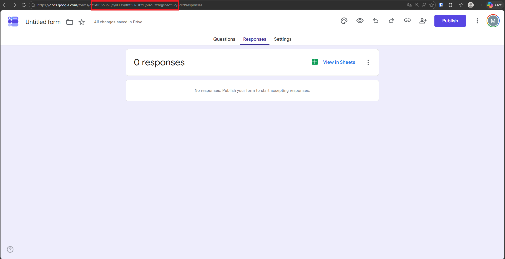

### 5. Primera ejecución

- En Apps Script, selecciona la función `actualizarDesplegable`
- Clic en ▶️ **Run**
- Acepta los permisos que solicita Google

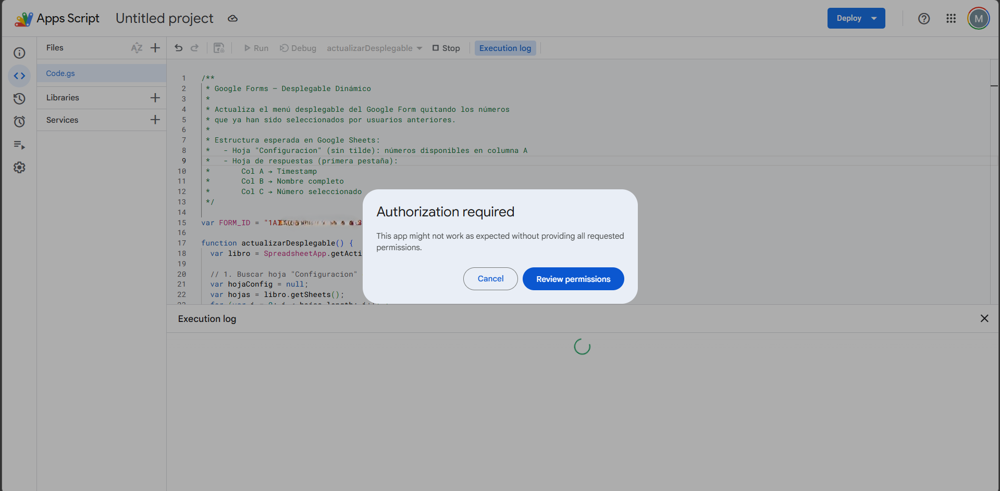

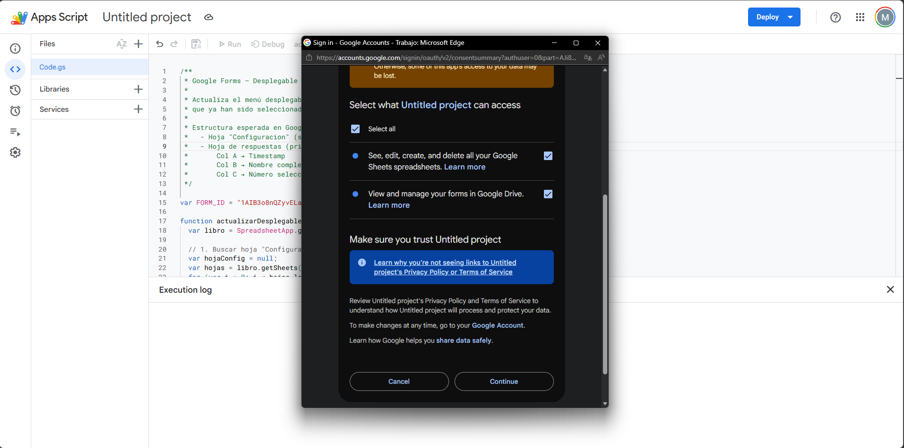

- Verifica en el **Execution log** que el desplegable se actualizó correctamente

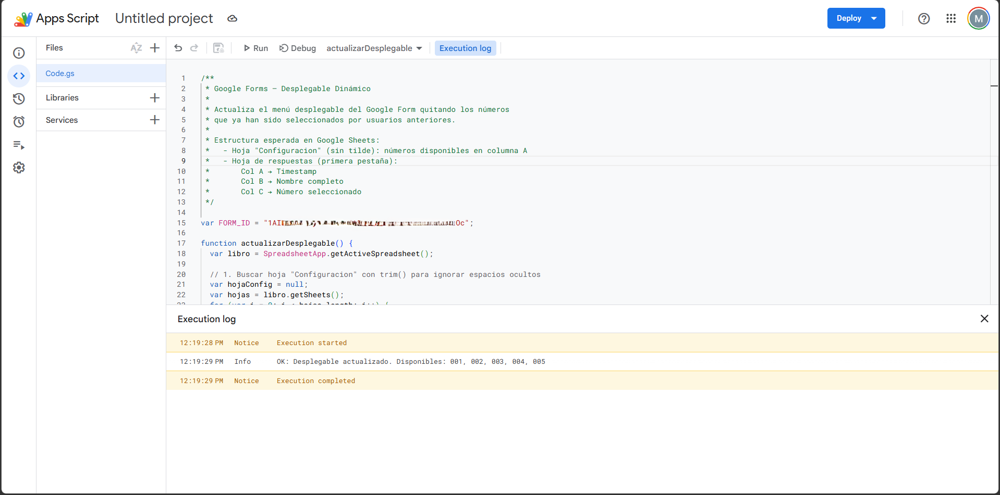

### 6. Configurar el trigger automático

- En Apps Script, clic en el ícono de reloj ⏰ **Triggers** (panel izquierdo)

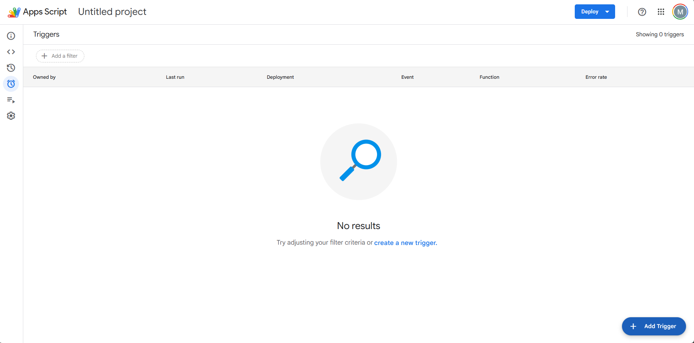

- Clic en **+ Add Trigger** y configura así:

  | Campo | Valor |
  |---|---|
  | Función | `actualizarDesplegable` |
  | Deployment | `Head` |
  | Event source | `From spreadsheet` |
  | Event type | `On form submit` |

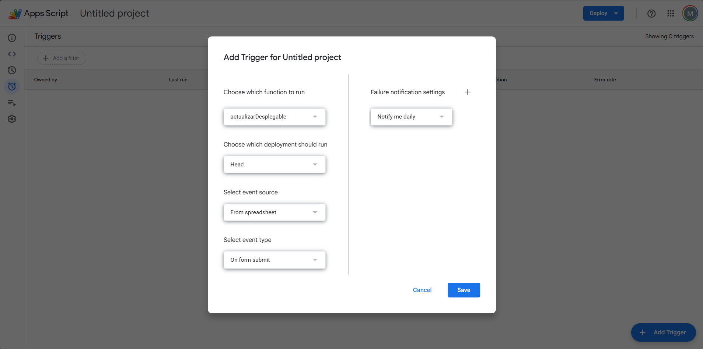

- Clic en **Save** — el trigger quedará registrado

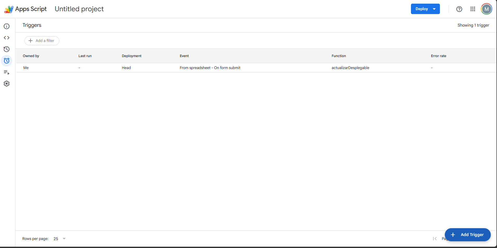

---

## Resultado final

El formulario que verán los usuarios muestra el desplegable con los números disponibles:

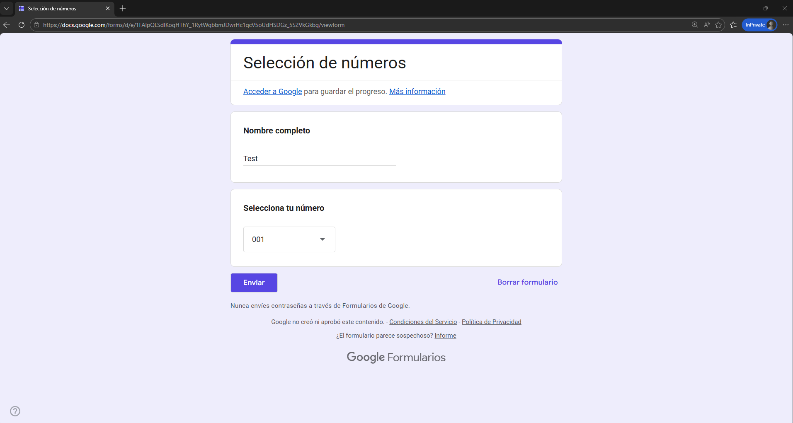

Cada respuesta queda registrada en la hoja de cálculo:

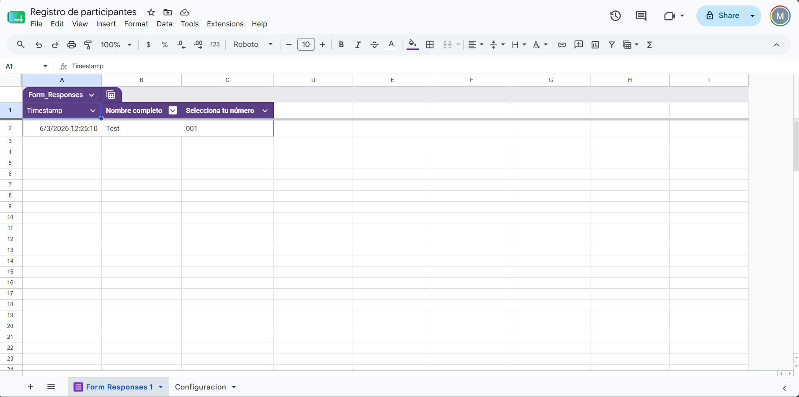

---

## Estructura esperada en Google Sheets

La hoja de respuestas (primera pestaña) queda así automáticamente:

| Col A | Col B | Col C |
|---|---|---|
| Timestamp | Nombre completo | Número seleccionado |

La hoja `Configuracion` debe tener:

| Col A |
|---|
| 1 |
| 2 |
| … |

---

## Notas técnicas

- El script usa `.trim()` al buscar la hoja `Configuracion` para tolerar espacios ocultos en el nombre de la pestaña.
- El `FORM_ID` está declarado como variable global al inicio del archivo para facilitar su edición.
- Los logs del script son visibles en Apps Script → **Execution log** (útil para depuración).

---

## Solución de problemas

| Error | Causa | Solución |
|---|---|---|
| `Cannot read properties of null` | No encuentra la hoja `Configuracion` | Verifica que el nombre no tenga tilde ni espacios extra |
| `No item with the given ID` | Form ID incorrecto | Copia el ID directamente desde la URL del formulario |
| El desplegable no se actualiza | El trigger no está configurado | Revisa el Paso 6 |
| Números no desaparecen | Script lee columna incorrecta | Verifica que el número esté en la columna C de respuestas |

---

## Tecnologías

- [Google Apps Script](https://developers.google.com/apps-script)
- [Google Forms API (FormApp)](https://developers.google.com/apps-script/reference/forms)
- [Google Sheets API (SpreadsheetApp)](https://developers.google.com/apps-script/reference/spreadsheet)
